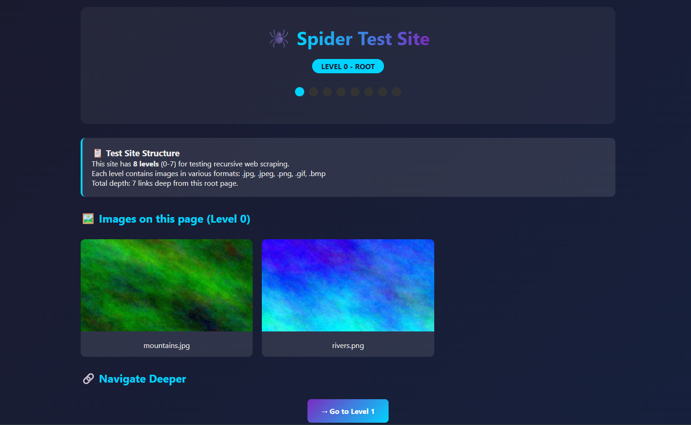

# 🕷️ Spider Test Site

A static test website for the **Arachnida** project (École 42).



## Overview

This multi-level website is designed to test recursive web scraping capabilities. It features 8 depth levels (0-7) with various image formats distributed across each level.

## Structure

```
spider-test-site/
├── index.html              # Level 0 (root) - 2 images
├── css/                    # Stylesheets
│   ├── styles.css          # Common styles
│   └── level*-colors.css   # Color schemes per level
├── images/                 # All images (28 total)
│   ├── mountains.jpg
│   ├── rivers.png
│   ├── level1_img1.jpg, level1_img2.png, level1_img3.gif
│   ├── level2_img1.jpg, level2_img2.png, level2_img3.gif
│   ├── ... (through level7)
│   ├── extra1.bmp          # on level 3
│   └── extra2.jpeg         # on level 5
└── level1/
    └── index.html          # Level 1 - 3 images
        └── level2/
            └── index.html  # Level 2 - 3 images
                └── level3/
                    └── ...  # through level7
```

## Test Statistics

| Depth | Pages | Images per Level | Formats |
|-------|-------|------------------|---------|
| 0     | 1     | 2                | jpg, png |
| 1     | 1     | 3                | jpg, png, gif |
| 2     | 1     | 3                | jpg, png, gif |
| 3     | 1     | 4 (+1 bmp)       | jpg, png, gif, bmp |
| 4     | 1     | 3                | jpg, png, gif |
| 5     | 1     | 4 (+1 jpeg)      | jpg, png, gif, jpeg |
| 6     | 1     | 3                | jpg, png, gif |
| 7     | 1     | 3                | jpg, png, gif |

**Total:** 8 pages, 28 images

## Features

### 📊 Visual Depth Indicator
Each page displays an 8-dot indicator showing:
- Active dots (cyan/colored) - current depth position
- Inactive dots (gray) - levels not yet reached

### 🧭 Sequential Navigation
- **Forward:** Single "→ Go to Level N+1" button
- **Backward:** "← Back to Level N-1" button
- Forces sequential depth traversal (no level skipping)

## Test Scenarios

```bash
# Root page only (no recursion)
./spider https://your-site.com/
# Expected: 2 images

# Recursion depth 1
./spider -r -l 1 https://your-site.com/
# Expected: 2 + 3 = 5 images

# Recursion depth 3
./spider -r -l 3 https://your-site.com/
# Expected: 2 + 3 + 3 + 4 = 12 images

# Default (depth 5)
./spider -r https://your-site.com/
# Expected: 2 + 3 + 3 + 4 + 3 + 4 = 19 images

# Full depth (7)
./spider -r -l 7 https://your-site.com/
# Expected: 28 images
```

## Deployment Options

### 1. GitHub Pages (Free)

```bash
# Create repository on GitHub
git init
git add .
git commit -m "Initial commit"
git remote add origin https://github.com/USERNAME/spider-test-site.git
git push -u origin main

# In repository settings:
# Settings → Pages → Source: main branch
# Site will be available at: https://USERNAME.github.io/spider-test-site/
```

### 2. Netlify (Free, Drag & Drop)

1. Go to [netlify.com](https://www.netlify.com/)
2. Drag and drop the `spider-test-site` folder into the browser
3. Done! You'll get a URL like `random-name.netlify.app`

### 3. Vercel (Free)

```bash
npm i -g vercel
cd spider-test-site
vercel
# Follow the prompts
```

### 4. Local Server (Development)

```bash
cd spider-test-site
python3 -m http.server 8080
# Open http://localhost:8080
```

### 5. Cloudflare Pages (Free)

1. Upload to GitHub
2. Connect repository to Cloudflare Pages
3. Automatic deployment

## Author

Created for testing the Arachnida project @ École 42 Paris
