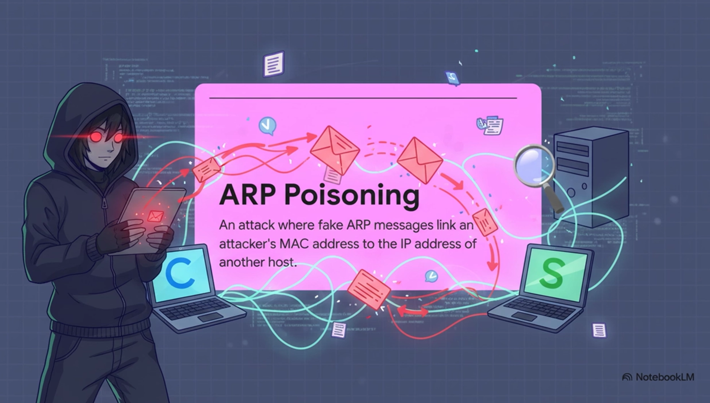

# Inquisitor: ARP Poisoning and FTP Interception Tool

Python-based ARP poisoning tool for man-in-the-middle attacks on FTP traffic. Intercepts and displays FTP commands, credentials, filenames, and file contents in real time, then restores ARP tables cleanly on exit.

**Warning:** This tool is for educational purposes only. ARP poisoning can disrupt networks and is illegal without permission.

 

## Contents

| File | Description |
|------|-------------|
| `inquisitor.py` | Main tool |
| `Dockerfile` | Container setup with dependencies |
| `docker-compose.yml` | Multi-service environment (attacker, FTP client, FTP server) |
| `Makefile` | Build and run automation |

## Setup

```bash
make up       # Build and start containers
make info     # Show IPs and MACs of all services
```

## Usage

```bash
python inquisitor.py <ip-src> <mac-src> <ip-target> <mac-target> [--verbose]
```

### Quick Start

```bash
make run          # Run without verbose
make run-verbose  # Run with full FTP traffic output
```

## Example Session

**Terminal 1 — start Inquisitor:**
```bash
make run-verbose
```

**Terminal 2 — transfer a file:**
```bash
docker exec -it ftp-client sh
lftp -u ftpuser:ftppassword ftp://ftp-server
!echo "test content" > testfile.txt
put testfile.txt
!rm testfile.txt
get testfile.txt
```

**Output:**
```bash
[*] Starting Inquisitor...
[*] Poisoning 172.18.0.3 <-> 172.18.0.2
[*] Sniffing FTP on port 21... (Ctrl+C to stop)
[FTP]      >>> Uploading: testfile.txt
[FTP DATA] >>> {PORT 21105} test content
```

## How It Works

1. **ARP Poisoning** — sends forged ARP replies to both hosts every 2 seconds, redirecting their traffic through the attacker machine
2. **Packet Sniffing** — captures TCP traffic on port 21 (control) and ports 21100–21110 (passive data)
3. **Restoration** — on `Ctrl+C`, sends 5 correct ARP replies to each host to restore the tables